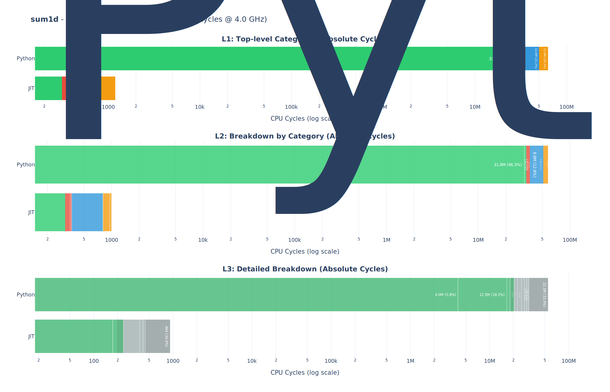
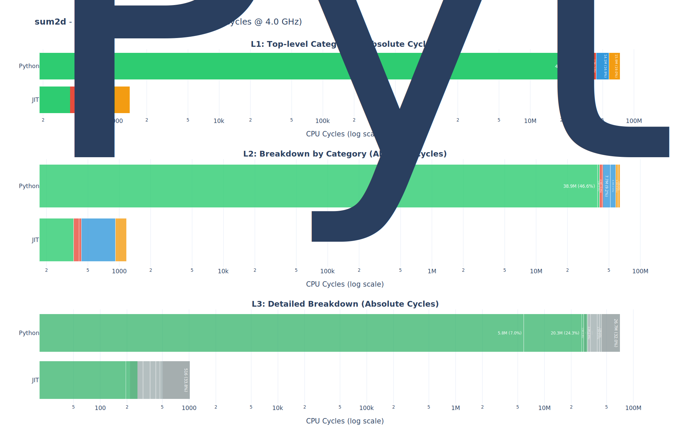
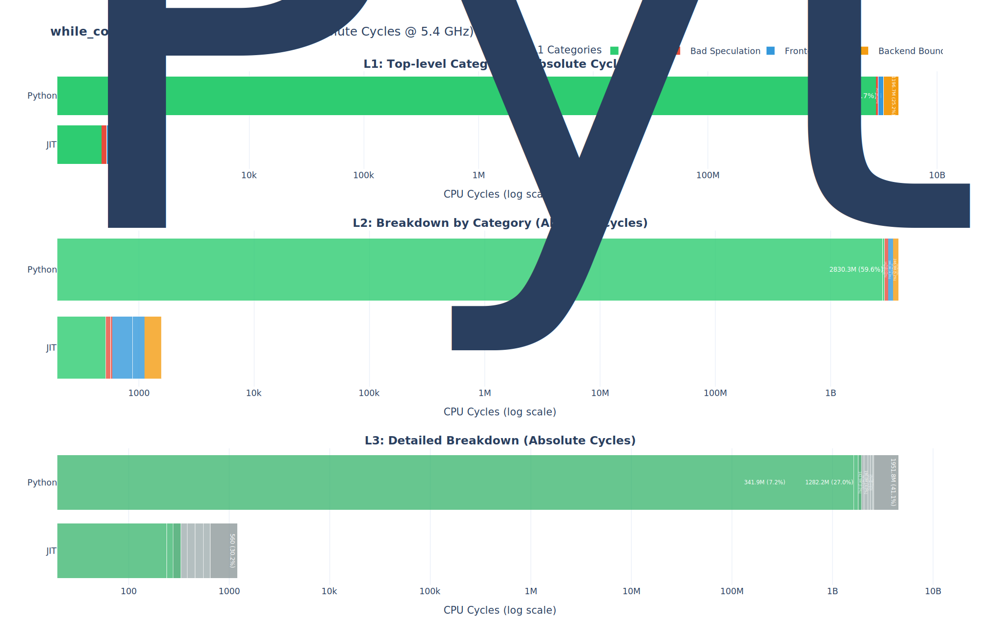
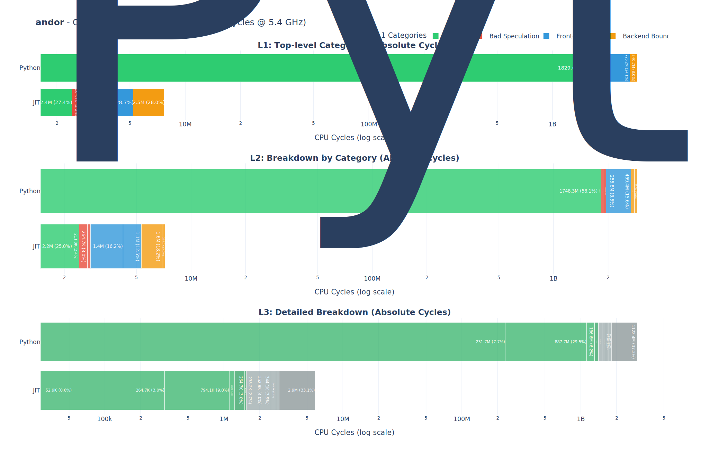
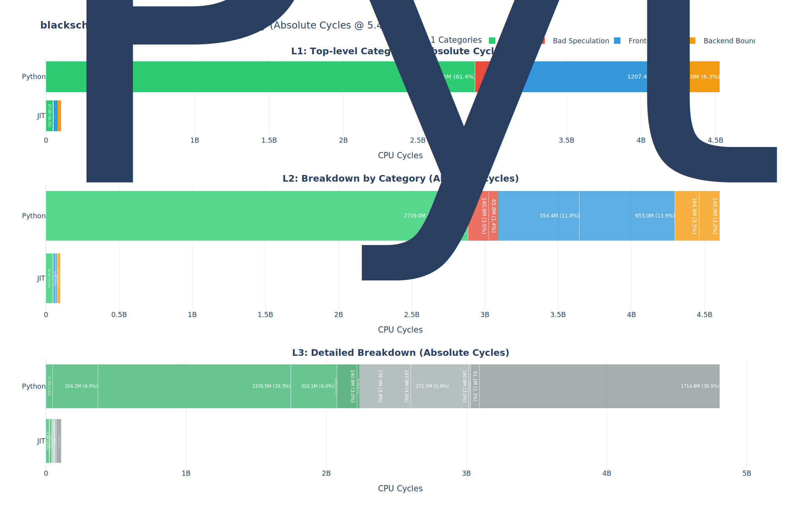
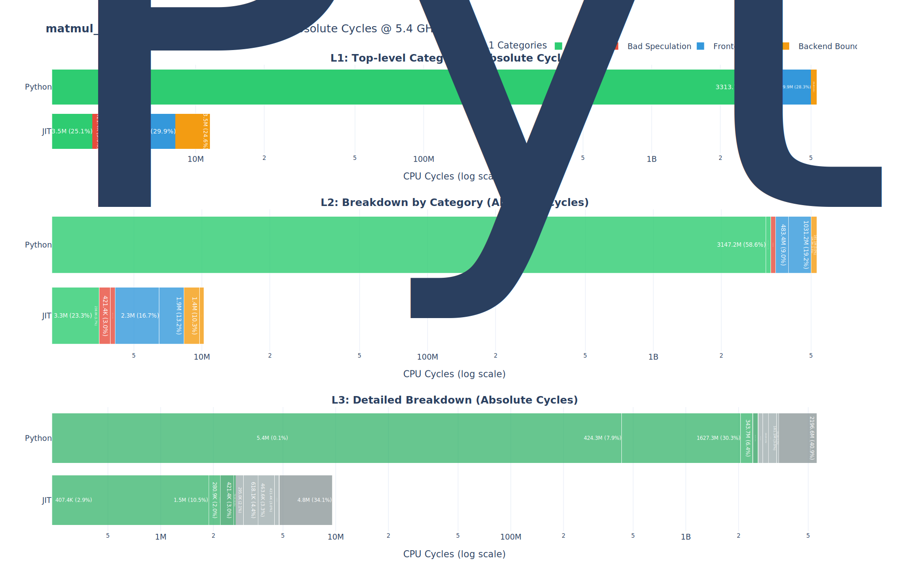
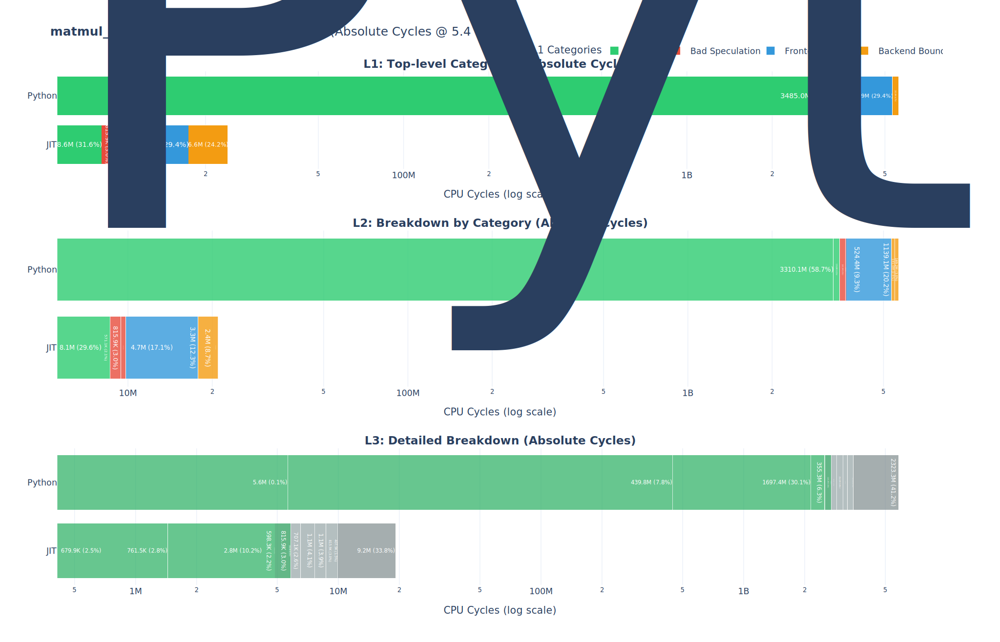
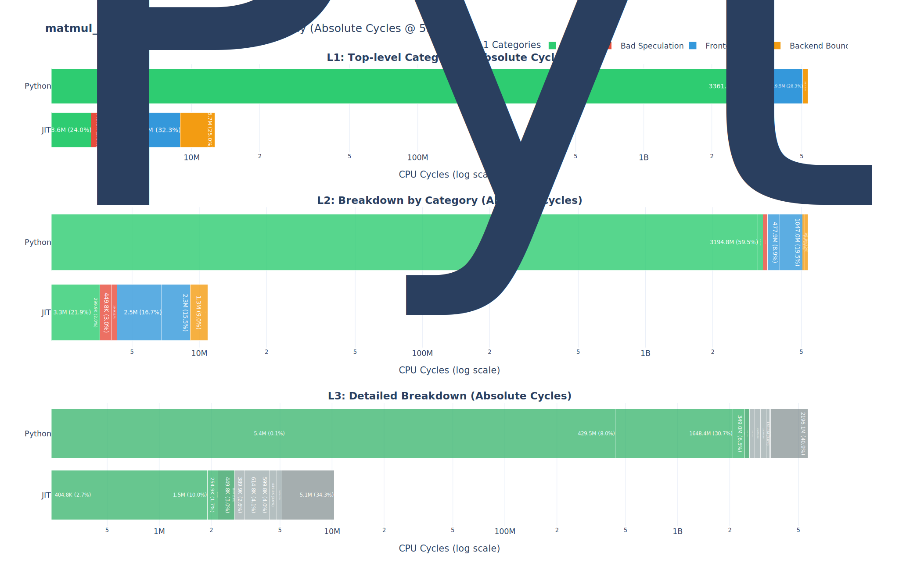

# TMA Metrics Visualization

Top-down Microarchitecture Analysis (TMA) hierarchy for all benchmark functions, showing absolute CPU cycles and execution times in appropriate units (ns, µs, ms, or s). Each plot includes a color legend and calculates speedup as: `Python time / JIT time`.

#### Legend

**L1 Categories (Top-level):**
- 🟢 **Retiring** (`#2ecc71`) - Useful work, instructions successfully retired
- 🔴 **Bad Speculation** (`#e74c3c`) - Wasted work from branch mispredicts and pipeline clears
- 🔵 **Frontend Bound** (`#3498db`) - CPU starved waiting for instructions to fetch/decode
- 🟠 **Backend Bound** (`#f39c12`) - CPU stalled on execution resources or memory

**L2 Categories:**
- Light/Heavy Operations, Branch Mispredicts, Machine Clears, Fetch Latency/Bandwidth, Memory Bound, Core Bound

**L3 Categories:**
- Detailed breakdowns including FP/Int arithmetic, memory hierarchy (L1/L2/L3/DRAM), port utilization, etc.

---

## sum1d
[**Code**](benchmark_usecases.py#L10-L15) • **Input:** `n=30,000,000` (sum integers from 0 to n)

## sum2d
[**Code**](benchmark_usecases.py#L17-L23) • **Input:** `n=2,000` (nested loop sum)

## while_count
[**Code**](benchmark_usecases.py#L25-L32) • **Input:** `n=30,000,000` (while loop sum)

## andor
[**Code**](benchmark_usecases.py#L34-L40) • **Input:** `n=5,000,000` (boolean logic on arrays)

## copy_arrays
[**Code**](benchmark_usecases.py#L42-L45) • **Input:** `n=5,000,000` (1D array copy)

## copy_arrays2d
[**Code**](benchmark_usecases.py#L47-L51) • **Input:** `n=2,000` (2D array `2000×2000`)

## blackscholes_cnd
[**Code**](benchmark_usecases.py#L53-L70) • **Input:** `n=5,000,000` (Black-Scholes CND on array)

## matmul_naive
[**Code**](benchmark_usecases.py#L72-L82) • **Input:** `n=200` (naive matrix multiply `200×200`)

## matmul_blocked
[**Code**](benchmark_usecases.py#L84-L101) • **Input:** `n=200`, `block_size=32` (blocked/tiled matrix multiply)

## matmul_transpose
[**Code**](benchmark_usecases.py#L103-L114) • **Input:** `n=200` (matrix multiply with pre-transposed B)

